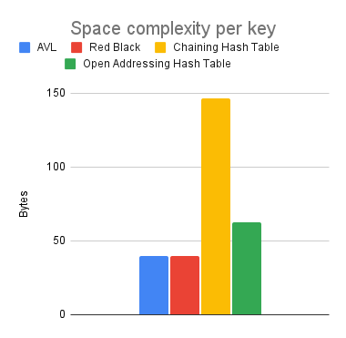
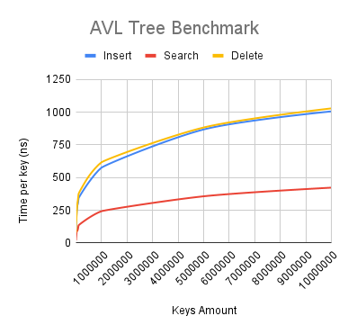
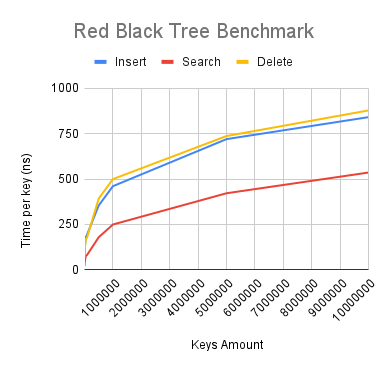
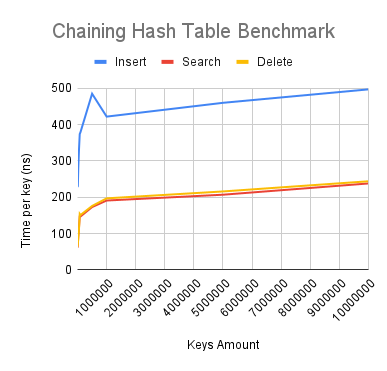
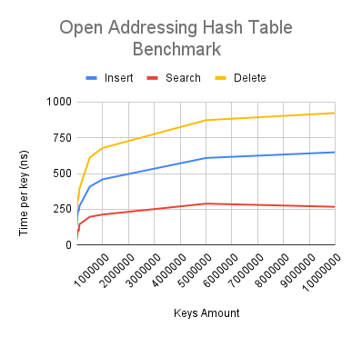
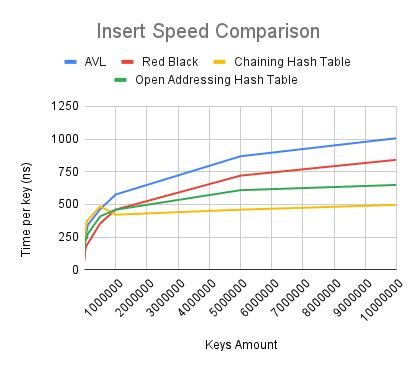
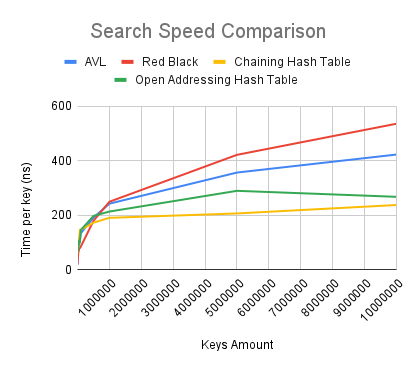
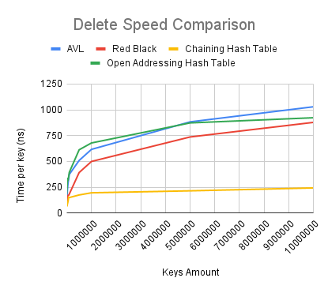

# I. Introduction
Welcome to this quirky, fun and important project where I will be comparing the performance of four important data structures: AVL Tree, Red-Black Tree, Chaining Hash Table, and Open Addressing Hash Table (double hashing). These data structures are widely used in various fields of computer science such as databases, file systems, and more. My goal in this project is to evaluate the time and space complexity of these structures and compare their performance.

# II. Background

Balanced trees and hash tables are two important data structures in computer science that are commonly used for efficient data storage and retrieval. 

A balanced tree is a data structure that maintains a balanced shape, ensuring that the height of the tree is proportional to the logarithm of the number of elements stored in it. This makes it possible to perform insertion, deletion, and search operations in O(log n) time, where n is the number of elements in the tree.

A hash table, on the other hand, is a data structure that uses a hash method to map keys to indices in an array. This allows for fast insertion, deletion, and search operations in O(1) time, on average, but it also uses a lot more space than a balanced tree.

Both of these data structure types have a worst-case time complexity of O(n), where n is the number of elements in the tree or hash table. This happens when the tree or hash table becomes unbalanced or when a collision occurs, respectively.

In this project I used AVL Tree, Red-Black Tree, Chaining Hash Table, and Open Addressing Hash Table (double hashing) as my data structures and implemented them in C++. These implementations aim to provide a balance between simplicity and performance, while somewhat adhering to standard programming practices and guidelines. In the following sections, I will describe my implementations in detail, including their technical details, algorithms, and design choices. I will also present my testing methodology and results, and discuss the strengths and weaknesses of each data structure.


# III. Technical Details
This is just a brief overview of the data structures. You can just skip straight to the [implementation](#iv-implementation) section if you want to see the code.
## A. AVL Tree
The avl tree is a self-balancing binary search tree. It is named after its two inventors, Georgy Adelson-Velsky and Evgenii Landis. The AVL tree was the first such data structure to be invented. In an AVL tree, the heights of the two child subtrees of any node differ by at most one; if at any time they differ by more than one, rebalancing is done to restore this property. Lookup, insertion, and deletion all take O(log n) time in both the average and worst cases, where n is the number of nodes in the tree prior to the operation. Insertions and deletions may require the tree to be rebalanced by one or more tree rotations.
Explaining the implementation of AVL tree is a bit complicated, so we will just give a link to a really good explanation of it: https://www.geeksforgeeks.org/avl-tree-set-1-insertion/

## B. Red-Black Tree
Much like the AVL tree, the red-black tree is a self-balancing binary search tree. It is named after the color used to represent its two colors in its node representation. In a red-black tree, each node is colored either red or black. By constraining how unbalanced the tree can become in certain cases, the red-black tree ensures that the height of the tree remains O(log n) in the average case, where n is the number of nodes in the tree prior to the operation. Insertions and deletions may require the tree to be rebalanced by one or more tree rotations.
The red-black tree must conform to the following red-black properties in order to remain balanced:
1. Every node is either red or black.
2. The root is black.
3. Every leaf (NIL) is black (or in the case of this implementation, NULL)
4. If a node is red, then both its children are black.
5. For each node, all simple paths from the node to descendant leaves contain the same number of black nodes.

## C. Chaining Hash Table
A hash table is a data structure that uses a hash method to map keys to indices in an array. This allows for fast insertion, deletion, and search operations in O(1) time, on average. In this implementation, we use chaining to resolve collisions. Chaining is a method of resolving collisions in which each index of the hash table's array is a pointer to a linked list. When a collision occurs, the new key-value pair is inserted into the linked list at the corresponding index. This allows for O(1) insertion, deletion, and search operations in the average case, but O(n) in the worst case, where n is the number of elements in the linked list at the corresponding index.

## D. Open Addressing Hash Table (double hashing)
Open addressing is a method of resolving collisions in which each index of the hash table's array is either empty or contains a key-value pair. When a collision occurs, the hash table probes the array for an empty slot using a probing method. If an empty slot is found, the new key-value pair is inserted into the array at that index. If no empty slot is found, the probing method is applied again to find a new index to probe. This process is repeated until an empty slot is found or the probing method returns an index that has already been probed. This allows for O(1) insertion, deletion, and search operations in the average case, but O(n) in the worst case, where n is the number of elements in the hash table.

# IV. Implementation
The implementation consists of a Testing/Benchmarking framework, the gui and the data structures themselves. The Testing/Benchmarking framework is used to test the performance of the data structures. The gui is used to visualize the data structures. The data structures themselves are implemented in the modules folder.
Let's start with the data structures themselves.
## Data Structures
### A. AVL Tree

Now we already know how the AVL tree works, so let's explore how it is implemented in the code. The implementation of the AVL tree is done in the [AVLTree.h](src/modules/AVLTree.h) and [AVLTree.cpp](src/modules/AVLTree.cpp) files. I recommend checking out the header file first, because it contains a quick documentation of the methods. The implementation of the methods is in the cpp file.

#### **AVL Node**
```cpp

struct AVLNode {
	int key; // key of the node
	int value; // value of the node
	AVLNode *parent; // parent is used for easier traversal and harder rotations. Idk why I went this route. Probably because I like pointers :D
	AVLNode *left; // left child
	AVLNode *right; // right child
	int count; // used for counting the number of nodes in the subtree
	int height; // height of the node
	AVLNode(); // default constructor
	AVLNode(int key); // constructor with key
	AVLNode(int key, int value); // constructor with key and value
};
```

#### **AVL Variables**
```cpp
AVLNode *root; // root of the tree
int size; // number of nodes in the tree( mainly used to calculate the space complexity)
```

#### **AVL Helper methods**
The helper methods are used to get the height and balance of a node with the use of a ternary operator. If the node is NULL, the height or balance is 0, otherwise it is the height or balance of the node.  
```cpp
// These methods are used to get the height and balance of a node
int AVLTree::getHeight(AVLNode *node) { return (node == NULL) ? 0 : node->height; }
int AVLTree::getBalance(AVLNode *node) { return (node == NULL) ? 0 : getHeight(node->left) - getHeight(node->right); }
```

#### **AVL Rotation**
The Rotations are handled in one method which takes the node to be rotated and the direction of the rotation as parameters. The method returns the new root of the subtree.

```cpp
enum RotateDirection { LEFT, RIGHT };
```
When it comes to the rotations, they are implemented in one method because they are very similar and I dislike code duplication. The method takes the node to be rotated and the direction of the rotation as parameters.

Firstly it checks if the direction is left or right and then it prepares the nodes for the rotation. The nodes are `x` and `y`. `x` is the node to be rotated and `y` is the child of `x` in the direction of the rotation. After that it does the rotation and updates the heights of the nodes. The method returns the new root of the subtree.  
```cpp
AVLNode *AVLTree::rotate(AVLNode *x, RotateDirection direction) {
	AVLNode *y;
	// Prepare nodes
	if (direction == LEFT) {  // left rotation
		y = x->right;
		x->right = y->left;
		if (y->left != NULL) y->left->parent = x;

		y->left = x;
	} else {  // right rotation
		y = x->left;
		x->left = y->right;
		if (y->right != NULL) y->right->parent = x;

		y->right = x;
	}

	// Update parent
	y->parent = x->parent;
	x->parent = y;

	// Parent clause
	if (y->parent == NULL)
		root = y;
	else if (y->parent->left == x)
		y->parent->left = y;
	else
		y->parent->right = y;

	// Update heights
	x->height = 1 + max(getHeight(x->left), getHeight(x->right));
	y->height = 1 + max(getHeight(y->left), getHeight(y->right));

	// Return new root
	return y;
}
```

#### **AVL Balance**
The balance method is used to balance the tree after an insertion or deletion. It receives the unbalanced node as its argument and than traverses the tree and balances the nodes. Its implemented iteratively since it is more efficient than recursion.

There is an alternative way to implement the different balance methods for insertion and deletion. But I found it to be unnecessary since this one, which is used for deletion, works for both insertion and deletion.  

I initially wanted to avoid describing the implementation details of the balance method, since you can easily refer to the code, however, I will go over it briefly. The balance method essentially prepares the necessary variables, updates the node height, checks the balance of the node, and performs appropriate rotations based on the specific case of imbalance. This process is repeated as it traverses up the tree. Admittedly, it may seem mundane, but it is crucial for maintaining the balance of the tree.

```cpp
void AVLTree::balanceTree(AVLNode *node) {
	while (node != NULL) {
		int leftHeight = getHeight(node->left);
		int rightHeight = getHeight(node->right);

		// Update height
		node->height = 1 + max(leftHeight, rightHeight);

		int balance = leftHeight - rightHeight;

		// If the node is unbalanced, then there are 4 cases
		//  1. if the node is left heavy and the left child is left heavy - right rotation
		//  2. if the node is left heavy and the left child is right heavy - left rotation followed by right rotation
		//  3. if the node is right heavy and the right child is right heavy - left rotation
		//  4. if the node is right heavy and the right child is left heavy - right rotation followed by left rotation
		if (balance > 1) {
			if (getBalance(node->left) >= 0)
				node = rotate(node, RIGHT);
			else {
				rotate(node->left, LEFT);
				node = rotate(node, RIGHT);
			}
		} else if (balance < -1) {
			if (getBalance(node->right) <= 0)
				node = rotate(node, LEFT);
			else {
				rotate(node->right, RIGHT);
				node = rotate(node, LEFT);
			}
		}

		node = node->parent;
	}
}
```
#### **AVL Insertion**
Insertion is a quite simple. To insert a node, the `insertNode` method takes in the key and value as parameters. If the node with the given key doesn't already exist, it creates a new node with the key and value, inserts it in the tree, and calls the balance method to ensure that the tree remains balanced. If the node already exists, it simply updates the value of the existing node.

Additionally, we have an insert method that takes in the key and value as parameters, creates a new node with the key and value, and calls the insertNode method. The insert method is mainly provided in case there's a need to pass in a node to be inserted instead of just the key and value. It also has a boolean balance parameter which is used to determine whether the tree should be balanced after the insertion. This is useful when inserting multiple nodes at once, since we can balance the tree after all the nodes have been inserted. Or just for testing purposes.

```cpp
void AVLTree::insert(int key, int value) { insertNode(new AVLNode(key, value), true); }

void AVLTree::insertNode(AVLNode *node, bool balance) {
	if (node == NULL) return;

	// If the tree is empty, make the node the root
	if (root == NULL) {
		root = node;
		size++;
		return;
	}

	// Find the appropriate parent for the node (make it a leaf)
	AVLNode *current = root;
	AVLNode *parent = NULL;
	while (current != NULL) {
		parent = current;
		// If the key is less than the current node's key, go to the left
		if (node->key < current->key) {
			current = current->left;
			continue;
		}
		// If the key already exists, increment the count and return
		if (node->key == current->key) {
			current->count++;
			current->value = node->value;
			delete node;
			return;
		}
		// Else, go to the right
		current = current->right;
	}

	// Insert the node depending on its key value
	if (node->key < parent->key)
		parent->left = node;
	else
		parent->right = node;

	// Set the parent
	node->parent = parent;

	// Update the size and count
	size++;
	node->count = 1;

	// Balance the tree
	if (balance)
		balanceTree(node->parent);
}
```

#### **AVL Search**
The search method is self explanatory. It searches for the node with the key and If it finds it, it returns the node, otherwise it returns NULL.
```cpp
AVLNode *AVLTree::searchKey(int key) {
	AVLNode *current = root;
	while (current != NULL) {
		if (current->key == key) return current;
		current = (key < current->key) ? current->left : current->right;
	}
	return NULL;
}
```

#### **AVL Deletion**
Deletion is a bit more complicated. To delete a node with a specific key, we use the `deleteKey` method, which searches the tree for the node and then calls the `deleteNode` method to remove it. If the node with the given key is not found, the `deleteNode` method checks that the node is not NULL before attempting to delete it.

```cpp
void AVLTree::deleteKey(int key) {
	AVLNode *node = searchKey(key);
	deleteNode(node);
}
```

The `deleteNode` method deletes the node and balances the tree. 
There are three cases:
 1. If the node has exactly one direct child, then the node is replaced by its child. The child's key and value are copied to the node and the child is deleted.
 2. If the node has two children, then the node is replaced by its successor. The successor is the node with the smallest key in the right subtree. The successor's key and value are copied to the node and the successor is deleted.
 3. If the node has no children, then it is simply deleted.
After the node is deleted, the tree is balanced.

*I used an xor fo the first time ever in this method. So that's fun*
```cpp
void AVLTree::deleteNode(AVLNode *node) {
	if (node == NULL) return;

	// If the node only has one direct child
	if ((node->right == NULL) ^ (node->left == NULL)) {
		// Set the child as the node's parent's left or right child
		AVLNode *child = (node->right == NULL) ? node->left : node->right;
		// If the node is the root, set the child as the new root
		// Otherwise, set the child as the node's parent's left or right child
		if (node->parent == NULL) {
			root = child;
			child->parent = NULL;
		} else if (node->parent->left == node) {
			node->parent->left = child;
			child->parent = node->parent;
		} else {
			node->parent->right = child;
			child->parent = node->parent;
		}
		size--;
		balanceTree(node->parent);
		delete node;
		return;
	}

	// If the node has both children
	// Here we don't delete the node, but we find the largest node in the left subtree and copy its key to the node to be "deleted"
	// After that, we delete the very node we copied the key from, because it has at most one child
	if (node->right != NULL && node->left != NULL) {
		// Find the largest node in the left subtree
		AVLNode *removeNode = node->left;
		while (removeNode->right != NULL)
			removeNode = removeNode->right;

		// Copy the largest subtree's node's key to the node to be deleted
		node->key = removeNode->key;
		node->value = removeNode->value;

		// Make a pointer to the node to be deleted's parent
		AVLNode *tempLeafNode;
		tempLeafNode = removeNode->parent;

		// Delete the largest node
		deleteNode(removeNode);

		// Use the tempLeafNode pointer to balance the tree
		balanceTree(tempLeafNode);

		return;
	}

	// === If the node is a leaf ===
	size--;

	// if the node is the root just remove it
	if (node->parent == NULL) {
		root = NULL;
		delete node;
		return;
	}

	// Otherwise find which child of the parent is the node and set it to null
	if (node->parent->left == node)
		node->parent->left = NULL;
	else
		node->parent->right = NULL;

	balanceTree(node->parent);
	delete node;
}
```

### B. Red-Black Tree
Same as in the AVL Tree section, the Red-Black Tree is implemented in [RedBlackTree](src/modules/RedBlackTree.cpp) and [RedBlackTree.h](src/modules/RedBlackTree.h).
The main difference between the theoretical implementation of the Red-Black Tree and my implementation is that I didn't use NIL nodes to represent the leaves of the tree. The reason is less memory usage. although it does somewhat backfire when implementing some methods. So yeah, Fun.
#### **Red Black Node**
The node structure is identical to the AVL Tree node structure, except that it has a color field instead of a height field. 
```cpp
// RedBlackNode structure
struct RedBlackNode {
	int key; // The key of the node
	int value; // The value of the node
	RedBlackNode *parent; // The parent of the node
	RedBlackNode *left; // The left child of the node
	RedBlackNode *right; // The right child of the node
	int count; // The number of times the node has been inserted
	RedBlackNodeColor color;
	RedBlackNode(); // Default constructor
	RedBlackNode(int key, int value); // Key-Value Constructor
	RedBlackNode(int key, int value, RedBlackNodeColor color); // Key-Value-Color Constructor
};
```
The color field is an enum with two values: `black` and `red`.

```cpp
enum RedBlackNodeColor {
	black,
	red
};
```
#### **Red Black Variables**
The Red-Black Tree has exactly the same variables as the AVL Tree.
```cpp
RedBlackNode *root; // The root of the tree
int size; // The number of nodes in the tree
```
#### **Red Black Helper Functions**
here we have more helper methods than in the AVL Tree since Red-Black Trees are more complicated.

* Rotate  
The rotate method identical to the [AVL Tree rotate method](#avl-rotation), except that it doesn't update the height of the nodes.  
* The transplant method simply replaces the subtree rooted at node u with the subtree rooted at node v.  
	```cpp
	void RedBlackTree::transplant(RedBlackNode *u, RedBlackNode *v) {
		// If v is not null, set its parent to u's parent
		if (v != NULL)
			v->parent = u->parent;

		// If the parent of u is null, set the root to v
		if (u->parent == NULL) {
			root = v;
			return;
		}
		// If u is the left child of its parent, set the left child of the parent to v
		// Otherwise, set the right child of the parent to v
		(u == u->parent->left) ? u->parent->left = v : u->parent->right = v;
	}
	```
* The successor method returns the node with the smallest key that is larger than the key of the given node.
	```cpp
	RedBlackNode *RedBlackTree::successor(RedBlackNode *node) {
		// If the right child of the node is not null, return the leftmost child of the right child
		if (node->right != nullptr) {
			node = node->right;
			while (node->left != nullptr)
				node = node->left;

			return node;
		}
		// Otherwise, return the first ancestor of the node that is a left child of its parent
		RedBlackNode *parent = node->parent;
		while (parent != nullptr && node == parent->right) {
			node = parent;
			parent = parent->parent;
		}
		return parent;
	}
	```
#### **Red Black Insertion**
Insertion consists of two parts: the insertion of the node and the fixing(balancing) of the tree.

The insertion part, is similar to AVL Tree.
Here I also require the key and value as parameters. for the `insert` method. If there is not root then I set it as root and color it black. If not than I search for its new position and consecutively if it already exists. In the case it already exists I increment count and exit. Otherwise I set the new parent for the new node and update that parents left/right child reference. Finally we check if `fixInsert` needs to be called.
```cpp
void RedBlackTree::insert(int key, int value) {
	insertNode(new RedBlackNode(key, value));
}

void RedBlackTree::insertNode(RedBlackNode *node) {
	if (root == NULL) {
		root = node;
		size++;
		root->color = black;
		return;
	}

	// Initialize current and parent
	RedBlackNode *current = this->root;
	RedBlackNode *parent = NULL;  // Future parent of the node

	// Find the parent of the node
	while (current != NULL) {
		parent = current;
		if (node->key == current->key) {
			current->count++;
			delete node;
			return;
		}
		current = (node->key < current->key) ? current->left : current->right;
	}

	// Set the parent of the node
	node->parent = parent;
	// Set the node as the left or right child of the parent
	(node->key < parent->key) ? parent->left = node
							  : parent->right = node;
	size++;

	// If the parent is the root, the tree is balanced
	if (node->parent == NULL) {
		node->color = black;
		return;
	}

	// If the parent is black, or the grandparent is NULL, the tree is balanced
	if (node->parent->color == black || node->parent->parent == NULL) return;

	// Balance the tree
	fixInsertFrom(node);
}
```
To fix the red black node distribution so that is conforms to the rules of the Red Black Tree we use the `fixInsertFrom` method. It takes a pointer to the newly inserted node as a parameter.

The method loops until the parent of the newly inserted node is black. If the parent is red, it checks whether the uncle of the newly inserted node is red or black. If the uncle node is red (Case 1), it recolors the parent, the uncle, and the grandparent to black, black, and red, respectively. Then, the newly inserted node is set to its grandparent and the loop continues.

If the uncle node is black (Case 2), it checks whether the newly inserted node is on the same side as its parent or on the opposite side. If it's on the opposite side, a rotation is performed to move the newly inserted node to the same side as its parent. Then, it recolors the parent and grandparent to black and red, respectively, and performs a rotation on the grandparent.

The method continues until the root node is reached or a black parent is encountered. Finally, the color of the root node is set to black.

```cpp
void RedBlackTree::fixInsertFrom(RedBlackNode *node) {
	RedBlackNode *parent;
	// Continue looping until parent node is black
	while (node->parent != NULL && node->parent->color == red) {
		parent = node->parent;
		// Determine which side of the grandparent node the parent is on
		bool parentIsLeft = (parent == parent->parent->left);
		RedBlackNode *uncle = parentIsLeft ? parent->parent->right : parent->parent->left;
		// Case 1: Uncle node is red
		if (uncle != NULL && uncle->color == red) {
			parent->color = black;
			uncle->color = black;
			parent->parent->color = red;
			node = parent->parent;
		}
		// Case 2: Uncle node is black
		else {
			// Determine whether node is on the same side as the parent or opposite side
			bool nodeIsLeft = (node == (parentIsLeft ? parent->left : parent->right));
			// If node is on the opposite side of the parent, rotate node up to be on the same side
			if (!nodeIsLeft) {
				node = parent;
				rotate(node, parentIsLeft ? LEFT : RIGHT);
				parent = node->parent;
			}
			// Recolor parent and grandparent, and rotate grandparent
			parent->color = black;
			parent->parent->color = red;
			rotate(parent->parent, parentIsLeft ? RIGHT : LEFT);
		}
		if (node == root) break;
	}
	root->color = black;
}
```
#### **Red Black Search**
Red Black search is exactly same as in AVL. So i'm just gonna link that section to avoid repeating myself. [AVL Search](#avl-search)

#### **Red Black Deletion**
Just like in insertion, deletion consists of two parts: the deletion of the node and the fixing(balancing) of the tree.

The `deleteNode` method is responsible for removing a node from the red-black tree while `fixDeleteFrom` ensures that the red-black properties are still satisfied.

The method first determines which node to delete and its replacement based on whether the node has one or two children. If the replacement node is null, a dummy node is created with black color to act as a replacement. The method then replaces the deleted node with the replacement node, updating the parent pointer accordingly.

If the deleted node was black, the method calls the `fixDeleteFrom` method to restore the red-black properties. The method then deletes the dummy node if it was created and decrements the size of the tree. Finally, the method deletes the original node and updates the size of the tree accordingly.

```cpp
void RedBlackTree::deleteNode(RedBlackNode *node) {
	if (node == nullptr) return;

	// Determine the node to delete (y) and its replacement (x)
	RedBlackNode *y = (node->left == nullptr || node->right == nullptr) ? node : successor(node);
	RedBlackNode *x = (y->left != nullptr) ? y->left : y->right;

	// If x is null, create a dummy NIL node
	if (x == nullptr) x = new RedBlackNode(-1, -1, black);

	// Set the parent of x to the parent of y
	x->parent = y->parent;

	// Replace y with x in the tree
	if (y->parent == nullptr)
		root = x;
	else if (y == y->parent->left)
		y->parent->left = x;
	else
		y->parent->right = x;

	// If y and node are different nodes, copy the values from y to node
	if (y != node) {
		node->key = y->key;
		node->value = y->value;
		node->count = y->count;
	}

	// If y was black, fix the tree starting from x
	if (y->color == black) fixDeleteFrom(x);

	// If x is a dummy NIL node, delete it
	if (x->key == -1 && x->value == -1) {
		if (x->parent == nullptr)  // If x is the root, set the root to null
			root = nullptr;
		else if (x == x->parent->left)	// If x is a left child, set the left child to null
			x->parent->left = nullptr;
		else  // If x is a right child, set the right child to null
			x->parent->right = nullptr;

		delete x;
	}
	size--;
	// Delete y
	delete y;
}
```

`fixDeleteFrom` is a complex one. It is responsible for maintaining the balance and properties of a Red-Black Tree after deleting a node from the tree. The method takes a pointer to the node from where the deletion was initiated as an argument.
It works by following a set of rules (called cases) to rebalance the tree after deletion (We already know this from theory). It starts from the deleted node and traverses up the tree towards the root while applying the cases until the root node is reached. At each step, the method checks the color of the node's sibling, its children, and its grandchild nodes (if any) to determine which case should be applied.  
Here are the cases just in case:
* Case 1: Sibling is red: Rotate the parent of node and make the sibling black.
* Case 2: Sibling and its children are black: Make the sibling red and move up the tree.
* Case 3: Sibling's outer child is black: Rotate the sibling and make the sibling's inner child black.
* Case 4: Sibling's outer child is red: Rotate the parent of node and make the sibling's outer child black.

Since I dislike code duplication I simplified the long mirrored if and else blocks usually implemented here. The method makes use of several helper variables along side ternary operators to simplify the code and improve its readability. For instance, it initializes variables for the sibling node and its child node colors, it also determines if the node is a left or right child of its parent to determine the sibling node.

Once the method has applied the necessary cases and the root node is reached, the method sets the color of the root node to black, ensuring that the properties of the Red-Black Tree are maintained.

```cpp
void RedBlackTree::fixDeleteFrom(RedBlackNode *node) {
	if (node == NULL) return;

	// Initialize variables
	RedBlackNode *sibling;
	RedBlackNodeColor siblingLeftChildColor;
	RedBlackNodeColor siblingRightChildColor;

	while (node != root && node->color == black) {
		// Determine if node is a left or right child of its parent
		bool isLeftChild = (node == node->parent->left);

		// Get sibling and its child colors based on whether node is a left or right child
		sibling = (isLeftChild) ? node->parent->right : node->parent->left;
		siblingLeftChildColor = (sibling && sibling->left) ? sibling->left->color : black;
		siblingRightChildColor = (sibling && sibling->right) ? sibling->right->color : black;

		// Case 1: Sibling is red
		// Rotate the parent of node and make the sibling black
		if (sibling && sibling->color == red) {
			sibling->color = black;
			node->parent->color = red;
			rotate(node->parent, (isLeftChild) ? LEFT : RIGHT);
			sibling = (isLeftChild) ? node->parent->right : node->parent->left;
			siblingLeftChildColor = (sibling && sibling->left) ? sibling->left->color : black;
			siblingRightChildColor = (sibling && sibling->right) ? sibling->right->color : black;
		}

		// Case 2: Sibling and its children are black
		// Make the sibling red and move up the tree
		if ((!sibling || siblingLeftChildColor == black) && (!sibling || siblingRightChildColor == black)) {
			if (sibling) sibling->color = red;
			node = node->parent;
		} else {
			// Case 3: Sibling's outer child is black
			// Rotate the sibling and make the sibling's inner child black
			if ((isLeftChild && siblingRightChildColor == black) || (!isLeftChild && siblingLeftChildColor == black)) {
				if (sibling) sibling->color = red;

				RedBlackNode *nephew = (isLeftChild) ? sibling->right : sibling->left;
				if (nephew) nephew->color = black;
				rotate(sibling, (isLeftChild) ? RIGHT : LEFT);
				sibling = (isLeftChild) ? node->parent->right : node->parent->left;
				siblingLeftChildColor = (sibling && sibling->left) ? sibling->left->color : black;
				siblingRightChildColor = (sibling && sibling->right) ? sibling->right->color : black;
			}

			// Case 4: Sibling's outer child is red
			// Rotate the parent of node and make the sibling's outer child black
			if (sibling) {
				sibling->color = node->parent->color;
				RedBlackNode *nephew = (isLeftChild) ? sibling->right : sibling->left;
				if (nephew) nephew->color = black;
			}
			node->parent->color = black;
			rotate(node->parent, isLeftChild ? LEFT : RIGHT);
			node = root;
		}
	}
	if (node) node->color = black;
}
```
### C. Chaining Hash Table
Hash tables are somewhat different from balanced trees as we already know.
When it comes to their implementation they are much easier to create in my opinion

#### **CHT Struct**
Just like in the trees, first we need a struct to contain the data.  
This struct is initialized as an array of `buckets` size.
The `keys` and `values` vectors are used as a substitute for a linked list for a easier implementation while still performing the same operations.

```cpp
struct HashTableChain {
	std::vector<std::string> keys;
	std::vector<int> values;
	int size; // Amount of values in bucket
};
``` 
#### **CHT Variables**
```cpp
	int size; // The amount of key-value pairs
	int buckets; // The amount of buckets
	float loadFactor = 0.75; // The load factor (max allowed ratio of buckets to size)
```
### **CHT Helper Method**

In the `initTable` method we initialize the hash table with a specified number of buckets, and optionally inserts a set of key-value pairs into the table.

It sets the number of buckets and size of the table to 0 if the number of buckets is 0, and creates an array of HashTableChain structs of size `buckets`. It nullifies all entries in the array and inserts all the key-value pairs if keys and values if they are provided.
```cpp
void CHashTable::initTable(int buckets, std::string* keys, int* values) {
	this->buckets = buckets;
	this->size = 0;
	if (buckets == 0) return;
	this->table = new HashTableChain[buckets];
	// Nullify all entries
	for (int i = 0; i < buckets; i++) table[i] = {{}, {}, 0};
	// Insert all keys
	if (keys != nullptr && values != nullptr)
		for (int i = 0; i < buckets; i++) insertKey(keys[i], values[i]);
}
```

This `getKeyIndex` method simply goes through a bucket and checks if has a key in it. Used in search for finding a key and in insert to check if a key already exists. 
```cpp
int CHashTable::getKeyIndex(std::string key, unsigned int index) {
	// Find if key already exists
	for (int i = 0; i < table[index].size; i++)
		if (table[index].keys[i] == key) return i;
	return -1;
}
```
The `clear` method simply clears the hash table
```cpp
void CHashTable::clear() {
	for (int i = 0; i < buckets; i++) {
		table[i].keys.clear();
		table[i].values.clear();
		table[i].size = 0;
	}
	size = 0;
}
```
#### **CHT Hash**
The hash method takes a key (as a const std::string&) input and returns an unsigned integer that represents the index of the bucket in the hash table where the key should be stored.  
It uses two different hash methods: a left shift and addition operation and a left shift and multiplication operation.
These two hash values are combined by adding the remainder of the first hash value divided by the number of buckets to the remainder of the second hash value divided by the number of buckets minus one, plus one. This ensures that the resulting hash value falls within the range of bucket indices in the hash table.

This distributes the keys evenly across the buckets in the hash table while minimizing the likelihood of hash collisions.

```cpp
unsigned int CHashTable::hash(const std::string& key) {
	unsigned long long hash1 = 0, hash2 = 0;
	for (size_t i = 0; i < key.length(); i++) {
		hash1 = (hash1 << 4) + key[i];
		hash2 = (hash2 << 5) + key[i];
	}
	return (hash1 % buckets + hash2 % (buckets - 1) + 1) % buckets;
}
```

#### **CHT Resize**
This method resizes the hash table to have a different number of buckets specified by the newBuckets parameter. It first ensures that newBuckets is at least 5 (because modulo operations with `1` won't work ), and then creates a new hash table with that number of buckets.

All entries in the new hash table are nullified by default. The method then iterates over all keys in the old hash table, calculates the new bucket index for each key using the hash() method, and inserts the key-value pairs into the new hash table. Finally, it deletes the old hash table and sets the newly created hash table as the current hash table.

In summary, this method allows the hash table to dynamically adjust its size as the number of elements stored in the table grows or shrinks, which helps to minimize collisions and maintain efficient performance.

```cpp
void CHashTable::resize(int newBuckets) {
	// Cap the min buckets to 5
	if(buckets == 5) return;
	newBuckets = max(newBuckets, 5);

	// Create a new table
	HashTableChain* newTable = new HashTableChain[newBuckets];
	int oldBuckets = buckets;
	buckets = newBuckets;
	// Nullify all entries
	for (int i = 0; i < buckets; i++) newTable[i] = {{}, {}, 0};
	// Insert all keys
	for (int i = 0; i < oldBuckets; i++) {
		for (int j = 0; j < table[i].size; j++) {
			std::string key = table[i].keys[j];
			int value = table[i].values[j];
			unsigned int index = hash(key);
			newTable[index].keys.push_back(key);
			newTable[index].values.push_back(value);
			newTable[index].size++;
		}
	}
	// Delete the old table
	delete[] table;
	// Set the new table
	table = newTable;
}
```
#### **CHT Insertion**

The `insertKey` method works as follows: it hashes the given key to determine which bucket to insert it into. Then, using the `getKeyIndex` method, it checks if the key already exists in that bucket. If it does, the method updates the value associated with that key and returns.

If the key does not exist in the bucket, the method appends the key and value to the end of the bucket's vectors. It then checks if the table needs to be resized.

```cpp
void CHashTable::insertKey(std::string key, int value) {
	unsigned int index = hash(key);
	// Find if key already exists
	int keyIndex = getKeyIndex(key, index);
	if (keyIndex != -1) {
		table[index].values[keyIndex] = value;
		return;
	}

	table[index].keys.push_back(key);
	table[index].values.push_back(value);
	table[index].size++;
	size++;

	if (size >= buckets * loadFactor) resize(buckets * 2);
}
```
#### **CHT Search**

The `searchKey` method is trivial. Here we get the bucket index of the key, check if the key exists in in that bucket, and return the value associated with it. If the key does not exists we return `-1`.

```cpp
int CHashTable::searchKey(std::string key) {
	unsigned int index = hash(key);
	int keyIndex = getKeyIndex(key, index);
	if (keyIndex == -1) return -1;
	return table[index].values[keyIndex];
}
```
#### **CHT Deletion**
Similarly to `insertKey`, the `deleteKey` method gets the bucket index from the key. Check if the key exists and delete it if it does.
And also calls resize if needed.
```cpp
void CHashTable::deleteKey(std::string key) {
	unsigned int index = hash(key);
	int keyIndex = getKeyIndex(key, index);
	if (keyIndex == -1) return;

	// If the entry has more than one key, resize the arrays
	table[index].keys.erase(table[index].keys.begin() + keyIndex);
	table[index].values.erase(table[index].values.begin() + keyIndex);
	table[index].size--;
	size--;
	// Resize the table if the load factor is too low
	if (size <= buckets * loadFactor / 2) resize(buckets / 2);
}
```
### D. Open Addressing Hash Table (double hashing)
#### **OAHT Struct**
The OAHashTableData struct contains keys and values vectors and is used as a container for each hash table instance. These vectors are dynamically resized, so they can be filled with any data. The keys vector is a pointer vector instead of a regular vector, which is the main difference from the chaining hash table implementations.
```cpp
struct OAHashTableData {
	// vector of string pointers
	std::vector<std::string*> keys;
	std::vector<int> values;
};
``` 
#### **OAHT Variables**
```cpp
	int size; // The amount of key-value pairs
	int capacity; // The number of possible elements in the table
	int tombstoneCount; // The number of deleted elements that are still in the table
```
### **OAHT Helper Method**
Here we have validation methods used to validate if a key can be inserted without causing problems.
```cpp
static bool isKeyValid(std::string key) {
	return key != "";
}
static bool isValueValid(int value) {
	return value != -1;
}
```
The `initTable` method initializes the open-addressing hash table. It takes the capacity of the table, an array of keys and an array of values as input, and their respective size. If the capacity is less than the size of the keys array, it resizes the table. If the capacity is zero, it returns.

This method creates an instance of `OAHashTableData` struct, which contains `keys` and `values` vectors. Then it nullifies all entries in the table by pushing null and 0 values respectively to their vectors. Afterward, it inserts all the `keys` and `values` using the `insertKey` method.
```cpp
void OAHashTable::initTable(int capacity, std::string* keys, int* values, int size) {
	this->capacity = capacity;
	this->size = 0;
	this->tombstoneCount = 0;

	// If the capacity is less than the amount of keys, resize the table
	// if (capacity < (keys != nullptr ? sizeof(keys) / sizeof(keys[0]) : 0)) {
	// 	resize(sizeof(keys) / sizeof(keys[0]));
	// }
	if (capacity == 0)
		return;

	this->table = new OAHashTableData;

	// Nullify all entries
	for (int i = 0; i < capacity; i++) {
		table->keys.push_back(NULL);
		table->values.push_back(0);
	}

	// Insert all the keys and values
	for (int i = 0; i < size; i++)
		insertKey(keys[i], values[i]);
}

```

`getKeyIndex` is an iterative function that uses double hashing to search through the entire table for a given key. The function returns the index where the key is found or -1 if it's not in the table.
It starts by computing the initial hash value for the key using hash1. It then computes the secondary hash value using hash2.
It then iterates through the table using double hashing until it finds the key or reaches the end of the table. If the key is found, it returns the index of the key. If the key is not found, it returns -1.
```cpp
int OAHashTable::getKeyIndex(std::string key) {
	int index = hash1(key);
	int hash2_val = hash2(key, 0);
	int i = 0;
	// Make sure we try linear search that activates after 10 failed double hash attempts
	int maxLoops = max(13, capacity);
	while (table->keys[index] != NULL && i < maxLoops) {
		// If the key is found, return the index
		if (*table->keys[index] == key) return index;
		index = getNextIndex(index, i, hash2_val);
		i++;
	}
	return -1;
}
```

For readability sake and to avoid repeating code, I created a `getNextIndex` method as a double hashing helper method.
This method calculates the next index to probe using double hashing. If double hashing fails 11 times, linear probing is used instead.
```cpp

int OAHashTable::getNextIndex(int index, int i, int hash2_val) {
	// If i is greater than 10, use linear probing otherwise use double hashing
	return (i > 10) ? (index + 1) % capacity : (index + i * hash2_val) % capacity;
}
```

Similarly to ChainHashTable, the `clear` method deletes all the keys and nullifies the values.
```cpp
void OAHashTable::clear() {
	for (int i = 0; i < capacity; i++) {
		if (table->keys[i] != NULL) {
			delete table->keys[i];
			table->keys[i] = NULL;
		}
		table->values[i] = 0;
	}
	size = 0;
}
```
#### **OAHT Hash**
Since I am using double hashing, logically I implemented two hashing algorithms.

The first one is a variation of the djb2 hash function, which iterates through the characters in a string and generates a hash code using bitwise operations and multiplication. The function takes a string key as input and outputs an integer hash code. The resulting hash value is computed using the djb2 formula and then modulo by the capacity of the hash table to ensure that the index falls within the bounds of the table.

```cpp
int OAHashTable::hash1(std::string key) {
	// djb2-like hash function
	unsigned long hash = 5381;
	for (size_t i = 0; i < key.length(); i++)
		hash = ((hash << 5) + hash) + key[i];
	return hash % capacity;
}
```
The second one uses the sdbm algorithm to hash the key by iterating over its characters and performing bitwise operations and arithmetic calculations. The iteration number is used to create a unique hash value for each key. Finally, the hash value is modulated by capacity-1 and incremented by 1 to ensure it falls within the range of valid indices for the table.
```cpp
int OAHashTable::hash2(std::string key, int iteration) {
	// sdbm-like hash function
	unsigned int hash = 0;
	for (size_t i = 0; i < key.length(); i++)
		hash = key[i] + (hash << 6) + (hash << 16) - hash;
	return (hash + iteration) % (capacity - 1) + 1;
}

```
#### **OAHT Resize**
The resize method is similar to the one in the chaining hash table. 
It resizes the hash table to a new capacity by creating a new array of keys and values with the new capacity, transferring all non-deleted keys and values from the current table to the new arrays, deleting the current table, and then creating a new table with the new capacity and inserting all non-deleted keys and values from the new arrays into the new table.

The minimum capacity of the table is 5 to prevent the hash methods from encountering modulo errors.

First, the function creates new arrays for the keys and values, and then iterates through the current table, transferring all non-deleted keys and values to the new arrays. If a key is deleted (marked with an empty tombstone), the corresponding key and value in the current table are removed, and the tombstone count is decremented.

Then, the function clears the current table and sets the capacity to the new capacity. It also clears the keys and values in the table (which are set to null in the clear function). The function then initializes the new table by pushing back null keys and values for each index.

Finally, the function inserts all non-deleted keys and values from the new arrays into the new table using the insertKey function, and then deletes the new arrays.
```cpp
void OAHashTable::resize(int newCapacity) {
	// Cap the min capacity to 5
	if(capacity == 5) return;
	newCapacity = max(newCapacity, 5);

	// Clone the keys and values
	std::string* keys = new std::string[size];
	int* values = new int[size];

	// Go through the table and add all the keys and values to the arrays
	int index = 0;
	for (int i = 0; i < capacity; i++) {
		if (table->keys[i] == NULL)
			continue;
		// If the key is a thousand years old, it's dead, Jim. Kidding. But really if the key is a tombstone, delete it and continue
		if (*table->keys[i] == "") {
			delete table->keys[i];
			table->keys[i] = NULL;
			table->values[i] = 0;
			this->tombstoneCount--;
			continue;
		}
		keys[index] = *table->keys[i];
		values[index] = table->values[i];
		index++;
	}

	// Delete the table and reinitialize it
	clear();
	capacity = newCapacity;

	// Clear the keys and values beacuse clear() just sets them to null
	table->keys.clear();
	table->values.clear();

	// Reinitialize the table
	for (int i = 0; i < capacity; i++) {
		table->keys.push_back(NULL);
		table->values.push_back(0);
	}

	// Insert all the keys and values
	for (int i = 0; i < index; i++)
		insertKey(keys[i], values[i]);

	// Delete the arrays
	delete[] keys;
	delete[] values;
}
```
#### **OAHT Insertion**
The `insertKey` method inserts a new key-value pair into the hash table. It first checks if the key and value are valid. Then it hashes the key to get the initial index and calculates the hash2 value using the hash2 function.

If the size of the table exceeds 75% of its capacity, the table is resized by doubling the capacity. Then the table is probed using double hashing until an empty slot is found. If the key already exists in the table, its value is updated and the function returns. Otherwise, the key-value pair is inserted into the first available slot, and the size of the table is incremented.
```cpp
void OAHashTable::insertKey(std::string key, int value) {
	if (!isKeyValid(key) || !isValueValid(value)) return;
	int index = hash1(key);
	int hash2_val = hash2(key, 0);
	int i = 1;

	// Check if the table needs to be resized
	if ((double)size / capacity >= 0.75) {
		resize(capacity * 2);
		index = hash1(key);
		hash2_val = hash2(key, 0);
	}

	// Probe the table using double hashing until an empty slot is found
	while (table->keys[index] != NULL) {
		// If the key already exists, update its value and return
		if (*table->keys[index] == key) {
			table->values[index] = value;
			return;
		}
		index = getNextIndex(index, i, hash2_val);
		i++;
	}

	// Insert the key and value into the first available slot
	table->keys[index] = new std::string(key);
	table->values[index] = value;
	size++;
}
```
#### **OAHT Search**
The `searchKey` method, just like in chaining, returns the value of the key if it exists in the table. Otherwise, it returns -1.
It uses the `getKeyIndex` method to get the index of the key in the table.

```cpp
int OAHashTable::searchKey(std::string key) {
	if (!isKeyValid(key)) return -1;
	int index = getKeyIndex(key);
	return (index == -1) ? -1 : table->values[index];
}
```
#### **OAHT Deletion**
The `deleteKey` method deletes a key-value pair from the hash table based on the given key. If the key is not valid or does not exist in the hash table, the function returns without doing anything. If the key is found, the function sets the corresponding key to a tombstone and decrements the size of the hash table. If the hash table is less than 25% full after the deletion, it is resized. If the hash table has more than 50% tombstones, it is rehashed.
```cpp
void OAHashTable::deleteKey(std::string key) {
	if (!isKeyValid(key)) return;
	int index = getKeyIndex(key);
	if (index == -1) return;
	if (table->keys[index] == NULL) return;
	delete table->keys[index];
	// Set the key to a tombstone
	table->keys[index] = new std::string("");
	size--;
	table->values[index] = 0;

	tombstoneCount++;

	// If the table is less than 25% full, resize it
	if ((double)size / capacity <= 0.25) resize(capacity / 2);

	// If the table has more than 50% tombstones, rehash it
	if ((double)tombstoneCount / capacity >= 0.5) {
		rehash();
		tombstoneCount = 0;
	}
}
```


## Testing/Benchmarking framework
I made my own testing framework for this project. It's somewhat robust and can be used for testing other data structures as well. It's not perfect, but it works.
A kind of interface or Wrapper is used to make a standard in interfacing with each data structure. This helps in making the testing framework more robust and easy to use instead of having to write tests for each data structure separately (which is unnecessary when the data structures are similar in nature).
The interface is defined in [global.h](src/globals.h) and is used in [Test.cpp](src/utilities/Test.cpp) to test the data structures.
```cpp
class DSStandardWrapper {
public:
	std::string name = "Example"; // Name of the data structure
	DSStandardWrapper();
	~DSStandardWrapper();
	virtual void init(int); // Initialize the data structure
	virtual void insert(int); // Insert a key
	virtual int search(int); // Search for a key
	virtual void returnlessSearch(int); // Search for a key without returning anything
	virtual void remove(int); // Remove a key
	virtual bool isValid(); // Check if the data structure is valid
	virtual int getSize(); // Get the size of the data structure
	virtual long long calculateSpaceComplexity(); // Calculate the space complexity of the data structure
	virtual void destroy(); // Destroy the data structure
};
```
This interface is implemented by each data structure in their respective wrapper files. For example, the interface for the AVL Tree is implemented in [AVLTreeWrapper.cpp](src/utilities/wrappers/AVLTreeWrapper.cpp).
it simply overrides the methods in the main interface and calls the corresponding methods in the data structure.
Every method is trivial and self-explanatory except for `isValid`(in trees) and `calculateSpaceComplexity`(in hash tables).
Both calculations are explained further down in this section.
Note that even though each data structure has a key and a value input, the wrapper classes only use the key as both the key and the value. This is because it makes it easier to test the data structures if a key and value were maybe misplaced.
These are the wrapper classes for each data structure:
- [AVLTreeWrapper.cpp](src/utilities/wrappers/AVLTreeWrapper.cpp)
- [RedBlackTreeWrapper.cpp](src/utilities/wrappers/RedBlackTreeWrapper.cpp)
- [CHashTableWrapper.cpp](src/utilities/wrappers/CHashTableWrapper.cpp)
- [OAHashTableWrapper.cpp](src/utilities/wrappers/OAHashTableWrapper.cpp)

There is also a main Wrapper namespace which holds a reference to each data structure wrapper class. ([WrappedDS.cpp](src/utilities/wrappers/WrappedDS.cpp))
```cpp
// Array of pointers to the wrapper class
DSStandardWrapper *WrappedDS::DSentries[] = {
	new AVLTreeWrapper(),
	new RedBlackTreeWrapper(),
	new CHashTableWrapper(),
	new OAHashTableWrapper()
};

```
Instead of remembering the index of each data structure in the array, I made a `DataStructureType` enum which holds the index of each data structure in the array.([globals.h](src/globals.h))
```cpp
enum DataStructureType {
	AVL,
	RedBlack,
	HashTableChaining,
	HashTableOpenAddressing
};
```
Another general enum is the `RandomizationType` enum which is used to determine how the keys are generated for the tests and benchmarks.([globals.h](src/globals.h))
```cpp
enum RandomizationType {
	UNIQUE_RANDOM, // Unique random keys
	NON_UNIQUE_RANDOM, // Non-unique random keys (keys can be repeated)
};
```
### Testing
The testing framework is implemented in [Test.cpp](src/utilities/Test.cpp) (as the Test namespace). It includes 4 public methods:
```cpp
namespace Test {
	bool testFileExists(std::string filename); // Check if a test file exists
	bool run(DataStructureType dsType, TestType testType, RandomizationType randType); // Run a random test on a data structure
	bool run(DataStructureType dsType, TestType testType, std::string testFile); // Run a test on a data structure using a test file
	void generateTestFile(std::string testFile, RandomizationType randType, int* keysAmount, int keysAmountSize, unsigned int); // Generate a test file
}
```
I will just outline what the important methods do and how they work, and will refrain from cluttering this section with code. If you want to see the code, you can check the [Test.cpp](src/utilities/Test.cpp) file.


First let me mention the TestType enum. It is used to determine whether the test should be strict or basic. A strict test will check if the data structure is valid after every operation, while a basic test will only check if the data structure is valid after all the keys were inserted/removed. This is done to save time and to make the tests run faster. The TestType enum is defined in [globals.h](src/globals.h)
```cpp
enum TestType {
	BASIC,
	STRICT
};
```
We have two functions that generate/retrieve the keys and start the tests. 
```cpp
bool Test::run(DataStructureType dsType, TestType testType, RandomizationType randType)
bool Test::run(DataStructureType dsType, TestType testType, std::string testFile)
```

In the first function, we generate the keys depending on the `RandomizationType` and then run the tests on the data structure. The amount of test and keys we generate is hardcoded in Test.cpp. You can change it if you want.
```cpp
#define TESTS_AMOUNT 5
static int keysAmounts[TESTS_AMOUNT] = {100, 1000, 10000, 100000, 1000000};
```

in the second function, we read the keys from the test file and then run the tests on the data structure. The test file is a simple text file with the keys separated by a space. The first line of the file is the amount of keys in the file. The keys are generated using the `generateTestFile` function. This function takes a `RandomizationType` and the amount of keys to generate. It then generates the keys and writes them to a file. The file is then used to run the tests on the data structure.
```cpp
void Test::generateTestFile(std::string testFile, RandomizationType randType, int* keysAmount, int keysAmountSize, unsigned int seed)
```
After generating/retrieving the keys, we call another `run` function.
```cpp
static bool run(DataStructureType dsType, TestType testType, int* keys, int keysAmount, int testNum) {
```
This function takes a `DataStructureType`, a `TestType`, an array of keys, the amount of keys in the array and the test number. It then creates a new instance of the data structure wrapper class and runs the tests on it.
```cpp
ds->init(keysAmount);
// Run the test
bool passed = runTest(ds, testType, keys, keysAmount);
// Destroy the benchmark
ds->destroy();
```

The function that actually runs the tests is the `runTest` function. It takes a `DSStandardWrapper` pointer, a `TestType`, an array of keys and the amount of keys in the array. It then runs the test on the data structure and returns true if the test was successful and false if it failed.

```cpp
static bool runTest(DSStandardWrapper* ds, TestType testType, int* keys, int keysAmount);
```
To actually verify if the data structure is valid, we use `verifyInsert` and `verifyDelete` functions. These functions take a `DSStandardWrapper` pointer and a key. They then insert the key into the data structure and then remove it. If the data structure is valid after the operation, the function returns true, otherwise it returns false.
```cpp
static bool verifyInsert(DSStandardWrapper* ds, int* keys, int keysAmount);
static bool verifyDelete(DSStandardWrapper* ds, int* keys, int keysAmount, int expectedSize);
```
#### Insertion Verification
In `verifyInsert` we check if `ds->isValid()` returns true after inserting the key. Then we move on to checking if every that is supposed to be in the data structure is actually in it. We do this by calling `ds->search(key)` for every key in the data structure. If any one of the keys is not in the data structure, we return false. If all the keys are in the data structure, we move on to checking if there aren't too many keys in the data structure.
```cpp
// Check if each key is in the data structure
for (int i = 0; i < keysAmount; i++) {
	if (ds->search(keys[i]) == -1) {
		std::cout << RED "[FAILED]" RESET << std::endl;
		std::cout << "Test failed: " << ds->name << " Key " << keys[i] << " is not in the data structure" << std::endl;
		return false;
	}
}
```
Now to check if there aren't too many keys in the data structure, we use `ds->getSize()` to get the size of the data structure and compare it to the amount of keys we inserted. If the size is bigger than the amount of keys, we return false.
Otherwise if all of the above checks passed, the data structure is valid after insertion and we return true.

#### Deletion Verification  
Similar to the insertion test, we check if `ds->isValid()` returns true after deleting the key. Then we move on to checking if every key that is supposed to be removed from the data structure is actually removed. We again do this by calling `ds->search(key)` for every key in the data structure. If any one of the keys is still in the data structure, we return false. If all the correct keys are removed from the data structure, we check if we deleted only as many keys as we were supposed to. We do this by calling `ds->getSize()` and comparing it to the expected size. If the size is not equal to the expected size, we return false.
Otherwise if all of the above checks passed, the data structure is valid after deletion and we return true.  
#### Validity Verification
The validity verification of each data structure is done in the `ds->isValid()` function. As already mentioned, this function is implemented in the data structure wrapper class and we will go over each one of them in this section.
##### AVL Tree
The AVL tree validity verification is done in the `AVLTreeWrapper::isValid()` function. It only checks if the tree is balanced since checking if the AVL tree is a valid binary search tree is essentially done by searching if every node exists or does not exists in the tree (which is done in the `verifyInsert` and `verifyDelete` functions).

`AVLTreeWrapper::isValid()` simply calls the `isAVLTreeBalanced` functions and returns true if both of them return true.
The `isAVLTreeBalanced` function is a recursive function that goes through each node in the tree and checks if the balance of the node is correct. If it is not correct, it returns false. If it is correct, it calls itself on the left and right child of the node. If every node in the tree is balanced, the function returns true.
```cpp
// Go through each node and check if the balance is correct
static bool isAVLTreeBalanced(AVLTree* tree, AVLNode* node) {
	if (node == NULL) return true;
	if (abs(tree->getBalance(node)) > 1) return false;
	return (node->left == NULL || isAVLTreeBalanced(tree, node->left)) &&
		   (node->right == NULL || isAVLTreeBalanced(tree, node->right));
}
```

##### Red-Black Tree

For the Red-Black tree, we again have `RedBlackTreeWrapper::isValid()` function call another function, `isRedBlackTreeValid`. This function than initializes the black height of the tree to -1 and calls the `isRedBlackTreeValidHelper` function. The `isRedBlackTreeValidHelper` function is a recursive function that goes through each path in the tree and checks if the black height of the path is consistent, and if there are no two consecutive red nodes. If the whole tree satisfies these conditions, it returns true, otherwise it returns false.

```cpp
bool isRedBlackTreeValid(RedBlackTree* tree) {
	RedBlackNode* root = tree->root;
	int blackHeight = -1;
	int numBlackNodes = 0;
	return isRedBlackTreeValidHelper(tree, root, blackHeight, numBlackNodes);
}

static bool isRedBlackTreeValidHelper(RedBlackTree* tree, RedBlackNode* node, int& blackHeight, int& numBlackNodes) {
	// If we've reached the end of a path (i.e., a null node), check the black height of the path and return true.
	if (node == NULL) {
		// If this is the first time we're encountering a null node, save the black height.
		if (blackHeight == -1) blackHeight = numBlackNodes;

		// Otherwise, if the current path's black height doesn't match the saved black height, the tree is invalid.
		else if (blackHeight != numBlackNodes)
			return false;

		// Return true since we've reached the end of a path.
		return true;
	}

	// Check that a red node doesn't have a red child.
	if (node->color == red) {
		if (node->left != NULL && node->left->color == red) return false;
		if (node->right != NULL && node->right->color == red) return false;
	}

	// If we've encountered a black node, increment the number of black nodes on this path.
	if (node->color == black) numBlackNodes++;

	// Recursively validate the left and right subtrees, and return false if either is invalid.
	bool leftValid = isRedBlackTreeValidHelper(tree, node->left, blackHeight, numBlackNodes);
	if (!leftValid) return false;

	bool rightValid = isRedBlackTreeValidHelper(tree, node->right, blackHeight, numBlackNodes);
	if (!rightValid) return false;

	// If we've encountered a black node, decrement the number of black nodes on this path.
	if (node->color == black) numBlackNodes--;

	// If we've made it to the end of a path and haven't returned false, the tree is valid.
	return true;
}
```

##### Chaining Hash Table
There isn't much to the validity verification of the chaining hash table. The only thing we can test is if the key and values were not separated from each other (since we originally insert only the key and then also use it as a value in every wrapper's insert function).
We do this by going through each bucket in the hash table and checking if every element in the bucket has the same value as the key. If any of the elements in the bucket has a different value than the key, we return false. If all the elements in the bucket have the same value as the key, we return true.
```cpp
bool CHashTableWrapper::isValid() {
	// make sure that every key has the same value as the key
	for (int i = 0; i < table->buckets; i++)
		for (int j = 0; j < table->table[i].size; j++)
			if (table->table[i].values[j] != std::stoi(table->table[i].keys[j]))
				return false;

	return true;
}
```

##### Open Addressing Hash Table
Same as in the chaining hash table, we only check if the key and values were not separated from each other. This is self-explanatory.
```cpp
bool OAHashTableWrapper::isValid() {
	// make sure that every key has the same value as the key
	for (int i = 0; i < table->capacity; i++)
		if (table->table->keys[i] != NULL && *table->table->keys[i] != "" && table->table->values[i] != std::stoi(*table->table->keys[i]))
			return false;
	return true;
}
```
### Benchmarking
The benchmarking is done using the `Benchmark` namespace which is under the Test namespace.
```cpp
namespace Benchmark {
	extern bool verbose; // If true, the benchmark will print results to the console
	extern int verboseLevel; // The level of verbosity. 0 = no output, 1 = only the results, 2 = the results and the test details
	void run(enum DataStructureType dsType, int* keys, int keysAmount); // Run the benchmark on the data structure
	void run(enum DataStructureType dsType, RandomizationType randType, int keysAmount, int testAmount); // Run benchmarks on the data structure using random keys
	void run(enum DataStructureType dsType, std::string testFile); // Run benchmarks on the data structure using keys from a file
};
```	
Benchmarking also has two methods of running. For random tests the second `run` function that takes a `DataStructureType`, a `RandomizationType`, the amount of keys to generate and the amount of tests to run is used. For tests using keys from a file, the `run` function that takes a `DataStructureType` and a `std::string` which is the file name is used.
In order to run a single test we use the very first `run` function. It takes a `DataStructureType`, an array of keys, the amount of keys in the array and the test number. It then creates a new instance of the data structure wrapper class and runs a insert/search/delete benchmark on it saving the result of each test in order to calculate the global average time later on.
The single immediate average time of the benchmark is immediately printed to the console if the `verbose` variable is set to true.
It also records the space used by the data structure after each test. The space is calculated using the `ds->calculateSpaceComplexity()` function which returns the amount of bytes used by the data structure.

Insertion Example:
```cpp
// Run Insertion
auto duration = runBenchmark(ds, &DSStandardWrapper::insert, keys, keysAmount);
insertTotalTime += duration;
// Save space complexity
long long spaceComplexity = ds->calculateSpaceComplexity();
spaceComplexityTotal += spaceComplexity;
```


The meat of the benchmarking is the `runBenchmark` function. It takes a `DSStandardWrapper` pointer, a pointer to a `DSStandardWrapper` function, an array of keys and the amount of keys in the array. It then runs the benchmark on the data structure and returns the average time of the benchmark.
This one is quite small so I will directly include it here.
```cpp
static std::chrono::nanoseconds runBenchmark(DSStandardWrapper* ds, void (DSStandardWrapper::*dsFunction)(int), int* keys, int keysAmount) {
	// Start the timer
	auto start = std::chrono::high_resolution_clock::now();

	// Run the benchmark
	for (int i = 0; i < keysAmount; i++) {
		int key = keys[i];
		(ds->*dsFunction)(keys[i]);
	}

	// Stop the timer
	auto stop = std::chrono::high_resolution_clock::now();
	auto duration = stop - start;

	return duration;
}
```

The `runBenchmark` function is called three times for each test. Once for the insertion, once for the search and once for the deletion. The average time of the three tests is then calculated and returned. This function gets passed a pointer to the function that is supposed to be benchmarked in order to avoid writing three separate functions for each benchmark.

#### Space Complexity Calculation
Let's take a look at the space complexity calculation of the data structures.
The trees don't require any special space complexity calculation since they are implemented using non dynamic structures. The only thing that needs to be done is to calculate the size of the tree nodes (node struct) and the size of the tree itself (amount of nodes). `sizeof(Node) * tree->size`.
As for the hashes, since they have variably sized strings and do or don't hold values, the space complexity calculation is a bit more complicated.
##### Chaining Hash Table

In order to calculate the space complexity of the chaining hash table, we need to calculate the size of the keys and values vectors, the size of the int size variable and the size of the table itself. The size of the keys and values vectors is calculated by going through each bucket in the hash table and adding the size of each key and value in the bucket. The size of the int size variable is calculated by multiplying the amount of buckets in the hash table by the size of an int. The size of the table itself is calculated by multiplying the amount of buckets in the hash table by the size of a vector.
And finally, we add all the sizes together and return the result.
```cpp
long long CHashTableWrapper::calculateSpaceComplexity() {
	long long spaceUsed = 0;

	// Get te size of each key in the vector and the size of the vector
	for (int i = 0; i < table->buckets; i++) {
		for (int j = 0; j < table->table[i].size; j++)
			spaceUsed += table->table[i].keys[j].size() + SIZE_STRING;	// 32 is the size of std::string object
		// Get the size of the ints in the vector
		spaceUsed += table->table[i].size * SIZE_INT;
	}
	// Get the size of the keys nad values vectors and the int size variable
	spaceUsed += sizeof(table->buckets) + table->buckets * (SIZE_VECTOR + SIZE_VECTOR + SIZE_INT);
	return spaceUsed;
}
```

##### Open Addressing Hash Table
Similar to the chaining hash table, we need to calculate the size of the keys and values vectors, the size of the int size variable and the size of the table itself. The size of the keys and values vectors is calculated by going through each bucket in the hash table and adding the size of each key and value in the bucket. The size of the int size variable is calculated by multiplying the amount of buckets in the hash table by the size of an int. The size of the table itself is calculated by multiplying the amount of buckets in the hash table by the size of a vector.
And finally, we add all the sizes together and return the result.
```cpp
long long OAHashTableWrapper::calculateSpaceComplexity() {
	long long spaceUsed = 0;

	// Get the size of the vectors
	spaceUsed += SIZE_VECTOR;
	spaceUsed += SIZE_VECTOR;
	// Go through each string pointer and add exsiting strings sizes to spaceUsed
	for (int i = 0; i < table->capacity; i++)
		spaceUsed += table->table->keys[i] == NULL ? 0 : (*table->table->keys[i]).size() + SIZE_STRING;	 // the size of std::string object

	// Get the size of the ints in the vector
	spaceUsed += table->capacity * (SIZE_STRING_POINTER + SIZE_INT);  // 16 is the size of std::string pinter and 4 is the size of int
	return spaceUsed;
}
```

## GUI
I decided to omit properly documenting the GUI because of time shortness.
But it simply consists of a main ViewController which controls which views rendering function is ran each frame. Each view has a `draw` where we call other drawing function to draw stuff on the screen.
The GUI is implemented in `Dear ImGUI` using `glfw` for cross-compatibility.   
Ihe `gui` namespace is a custom wrapper for `imgui` enabling zooming in/out, panning and other neat features.
# V. Testing
As I already somewhat comprehensively explained how the testing works in the [Testing](#testing) section, so I will only briefly explain the testing process here and mainly focus on the results.
## Testing Process
The testing process is quite simple. It involves generating a random array of keys or using a test file to perform an insertion test on the data structure. After inserting the keys, a search test is performed to ensure that the data structure is valid and contains all the keys. The next step involves deleting all the keys from the data structure and performing another search test to ensure that the data structure is valid and the keys that should be deleted are removed. Finally, the insertion test is repeated to confirm that the data structure is still valid and can be used for re-insertion.

The purpose of this testing process is to ensure that the data structure can handle insertion, search, and deletion operations correctly. While specific details such as the correctness of left/right rotation or the quality of the hash function are not validated, any inaccuracies in these areas will become apparent in the test results, leading to failed tests. Therefore, the focus is on validating the data structure's ability to perform its core operations accurately rather than validating the individual components of the data structure.

## Testing Results And How To Verify Them
Every single data structure was extensively tested using the testing process described above. And the tests have passed every single time.  
To verify this for your self, you can run the tests yourself by running the `searchInDSA test` to get test options.
I tested the data structures with a test file that can be generated by running the `searchInDSA test gen testfile 10,50,100,500,1000,5000,10000,25000,50000,75000,100000,500000,1000000,5000000,10000000 unique 45`.
After running that you can test each data structure with the test file by running `searchInDSA test fixed testfile [a|r|o|c] [strict|basic]`.
The `[a|r|o|c]` is the data structure you want to test. And the `[strict|basic]` is the test mode. The `strict` mode will test the data structure with the test file and the `basic` mode will test the data structure with a random array of keys.

Here is a sample of the keys that were used in the test file. 
```
1-10:4 2 5 0 9 6 7 8 1 3 
2-50:44 13 0 25 34 40 19 32 9 10 ... 28 14 30 17 47 20 33 4 
3-100:8 57 2 62 24 87 3 16 35 74 ... 11 38 65 47 46 90 13 4 81 75 
4-500:118 323 378 89 254 46 82 481 ... 347 42 170 126 142 454 171 482 299
5-1000:235 811 274 690 809 39 759 ... 547 123 452 282 224 567 952 859
6-5000:1971 266 4053 2357 699 ... // Beyond here I can't show you last keys because my editor can't handle it. But be assure that your generated test file will have the same keys.
7-10000:2206 3301 8054 1090 2235 15
8-25000:18282 24988 15231 12690 9868 
9-50000:11151 11199 21568 4601 29335
10-75000:52305 19053 60408 58369 6470
11-100000:93619 11674 80870 59635 40605
12-500000:184515 157088 300887 112630 383081
13-1000000:64596 264623 557295 196778 642567 
14-5000000:427943 4586367 4834922 2799947 3394686
15-10000000:6586172 2456402 2318630 4964784 2117729
``` 
On my system this file has 129,050,267 bytes.
## Benchmarking Results

Before looking at the speed of each data structure, lets take a peek at their space complexity.  
[](img/space-complexity.png)  
Picture 1. Space complexity of each data structure  
As we can see, the chaining hash table uses the most space, followed by the open addressing hash table, the AVL tree, and the red-black tree. This is expected since the chaining hash table uses a vector for each bucket, while the open addressing hash table uses a vector for the keys and values. The AVL tree and the red-black tree use a single static size struct for the keys and values.

Now lets take a look at the speed of each data structure.  
[](img/AVLTree-benchmark.png)  
Picture 2. AVL tree benchmark  
Avl performance is quite good. As expected, it comes out logarithmic. The insertion and deletion are the slowest, while search is the fastest. The insertion and deletion are slow because the tree needs to be balanced after each insertion and deletion. Search is fast because the tree is balanced and the search function is very efficient.

[](img/RedBlack-benchmark.png)  
Picture 3. Red-black tree benchmark  
Red-black tree performance is also quite good. As expected, it comes out logarithmic. The insertion and deletion are also the slowest, while search is the fastest. Since it also has to be balanced after each insertion and deletion.

[](img/CHT-benchmark.png)  
Picture 4. Chaining hash table benchmark
Chaining hash table performance is super fast and near-constant. Insertion is the slowest bv`because it has to check if a key already exists in the bucket. The search, as expected, is the fastest because it uses a vector and the vector is very fast. The deletion is almost as fast as search, the only difference is that deletion, after finding the key, has to remove it from the vector. Which is not very expensive.
Note that if we would to omit from checking if a key already exists in the bucket, the insertion would be as fast as search and deletion, but we we also get duplicate keys (which we don't want).

[](img/OAHT-benchmark.png)  
Picture 5. Open addressing hash table benchmark  
Open addressing hash table performance is also super fast and near-constant. However, here the Delete operation is the slowest because it has to check rehash when there are too many tombstones and also resize the table if it is too empty. The search, as expected, is the fastest because it uses a vector and the vector is very fast. The insertion right in the middle of the two, Even tho it does virtually the same operations as search, it needs to resize the table if it is too full which can be expensive.

### Comparison
Let's compare the speed of each data structure.
Starting with insertion.  
[](img/insert-speed-comparison.png)  
Picture 6. Insertion speed comparison  
Here we can see that the chaining hash table is the fastest, followed by the open addressing hash table, the red-black tree, and the AVL tree.
The chaining hash table comes out twice as fast as AVL for 10 million keys. We can also see that the hash tables are slightly slower for a small amount of keys, but they are much faster for a large amount of keys. Which is expected if you graph a logarithmic function `log(x)` and linear `y=1`.

Now let's compare the search speed.  
[](img/search-speed-comparison.png)  
Picture 7. Search speed comparison  
Here we can see that the chaining hash table is the fastest, followed by the open addressing hash table, and for a fun change, the red-black tree is the slowest with the AVL tree being the second slowest.

Not much here to compare, since the results are pretty much the same as the insertion speed except for the red-black tree being the slowest.
It seems that my implementation of the red-black tree search is not as efficient as the AVL tree search. I will blame it on dark magic and move on.

Finally, let's compare the deletion speed.  
[](img/delete-speed-comparison.png)  
Picture 8. Deletion speed comparison  
No this one is fun. Chaining does what it does best, it is the fastest. But the Open addressing hash table seriously slowed down. It is slower than the red-black tree in this data set. of course if we used a larger data set, it would  come out faster than the trees. The AVL tree is the slowest, but it is not that far behind the red-black tree, or the open addressing hash table for that matter.

# VI. Conclusion
In conclusion, the benchmark results show that each data structure has its own advantages and disadvantages, and choosing the right one depends on the specific use case and performance requirements.

The chaining hash table was the fastest data structure, but it used the most space. On the other hand, the open addressing hash table was the second fastest data structure and used slightly more space than the trees, but it was slow at deletion due to the tombstone resolution. The red-black tree was the third fastest data structure and used the least space, while the AVL tree was the fourth fastest data structure and used the same amount of space as the AVL tree.

All data structures performed as expected, with trees achieving a logarithmic time complexity and hash tables achieving near-constant time complexity. However, hash tables are more dependent on the input and the quality of the hash function, whereas trees are more predictable in their performance.

Choosing between hash tables and trees requires understanding of the data structure and the data that is going to be stored in it. Hash tables can be easy to implement, but require a good hash function to achieve optimal performance. Trees, on the other hand, potentially require more work, but they provide predictable performance characteristics and are suitable for a wider range of data types.

Overall, the benchmarking project was a valuable exercise in comparing different data structures and understanding their trade-offs. Depending on the specific use case, the choice of hash table or tree data structure will vary. For cases where performance is a priority and memory usage is not a concern, the chaining hash table may be the best option. For cases where memory usage is a concern, Open Addressing or tree data structures may be more suitable.
